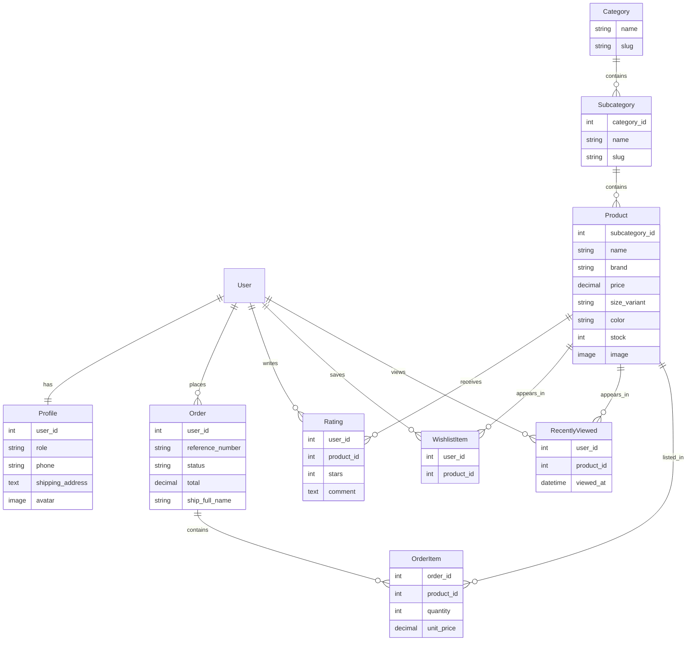

# Entity Relationship Diagram

The diagram below renders on GitHub.

The cart is not a table. It lives in the session so a guest can use it. At checkout the
session cart becomes an Order with its OrderItems.
